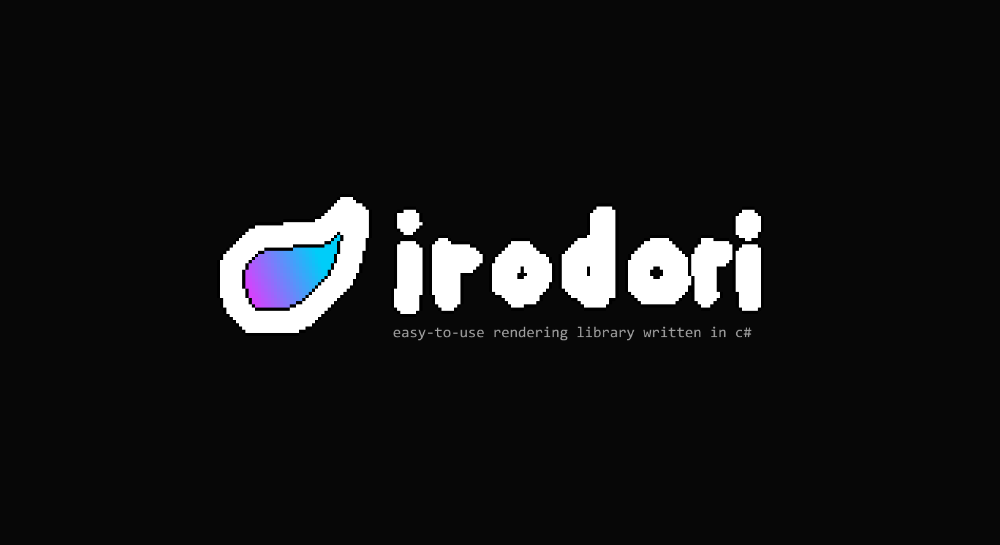

# irodori

> means "to color" in Japanese

a rendering library written in C#

## features

-   easy to use
-   minimal runtime exceptions
-   null safety

## supported backends

-   [x] opengl
-   [ ] vulkan
-   [ ] direct3d 11
-   [ ] direct3d 12
-   [ ] metal
-   [ ] webgl
-   [ ] webgpu
